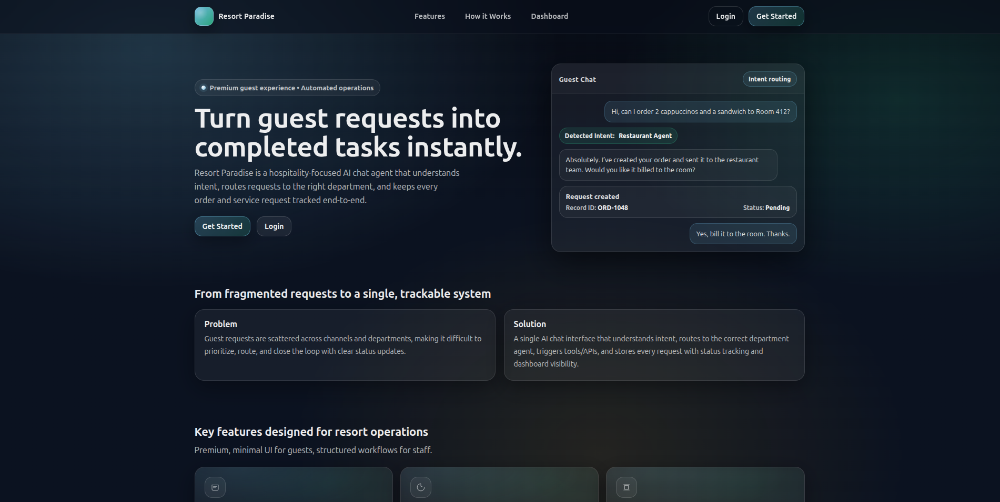
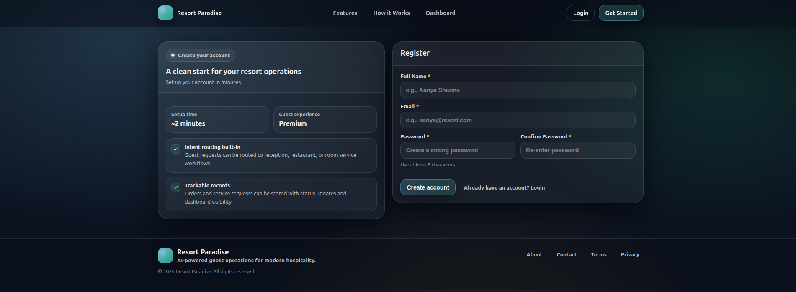
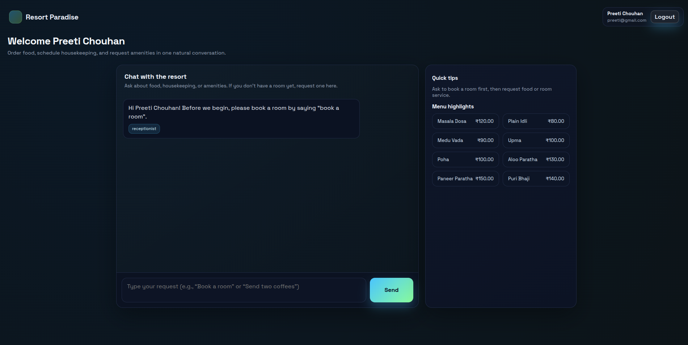
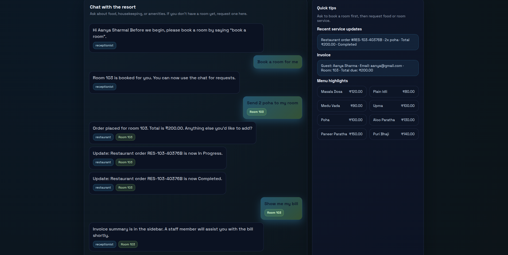
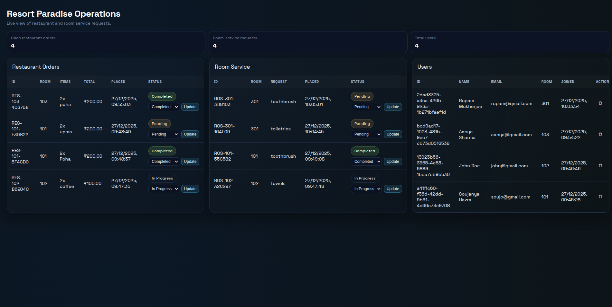

# Resort Agentic AI System

A chat-based, multi-agent resort assistant that routes guest requests across Receptionist, Restaurant, and Room Service, persists everything in SQLite, and surfaces operations through a live dashboard.

## System Architecture
```
Guest UI (Landing / Login / Register / Chat)
        |
        v
+---------------------------+
| FastAPI (app/main.py)     |
| - Auth (register/login)   |
| - Chat + routing          |
| - Dashboard APIs          |
| - Status updates          |
+---------------------------+
        |
        v
+---------------------------+
| Agent Orchestrator        |
| - ReceptionistAgent       |
| - RestaurantAgent         |
| - RoomServiceAgent        |
+---------------------------+
        |
        v
+---------------------------+
| SQLite (resort.db)        |
| Users / Rooms / Orders    |
| RoomService / Messages    |
+---------------------------+
```

## Agent Flow
1. **User logs in / registers** and enters the chat page.
2. **Room booking gate**: if no room assigned, the assistant asks them to book a room first.
3. **Intent detection** routes the request:
   - Receptionist: FAQs, availability, booking
   - Restaurant: menu + orders
   - Room Service: cleaning / laundry / amenities
4. **Agents persist records** with status `Pending` and unique IDs (`RES-...`, `ROS-...`).
5. **Dashboard updates** show live orders/requests with status controls.
6. **User sidebar** shows their service history + invoice summary.
7. **Status changes** on the dashboard automatically appear in the user chat (polling).

## Tech Stack
- **Backend**: FastAPI, SQLAlchemy
- **DB**: SQLite (`resort.db`)
- **LLM**: OpenAI 
- **Frontend**: HTML/CSS/JS
- **UI**: Landing, Register, Login, Chat, Dashboard

## Run Locally
```bash
# 1) Create venv
python -m venv .venv
source .venv/bin/activate       # Windows: .venv\Scripts\activate

# 2) Install dependencies
pip install -r requirements.txt

# 3) Create .env
cat > .env <<'ENV'
OPENAI_API_KEY=
OPENAI_MODEL=gpt-4o-mini
DATABASE_URL=sqlite:///./resort.db
DEBUG=false
ENV

# 4) Start server
uvicorn app.main:app --reload --port 8000
```

Open:
- Landing: http://localhost:8000/
- Register: http://localhost:8000/register
- Login: http://localhost:8000/login
- Chat: http://localhost:8000/chat
- Dashboard: http://localhost:8000/dashboard
- API docs: http://localhost:8000/docs

## AI Preview

1) **Landing page**


2) **Registration**


3) **Initial user chat**
- Greets the user and asks to book a room before services.


4) **Chat with AI**
- Shows order creation, status changes, and invoice sidebar.


5) **Operations dashboard**
- Shows orders, room service, and users with status controls.


## Key Endpoints
- `POST /api/register` — create user
- `POST /api/login` — login user
- `POST /api/chat` — send chat message
- `GET /api/users/{user_id}/history` — user’s service history
- `GET /api/users/{user_id}/invoice` — invoice summary
- `POST /api/orders/{order_id}/status` — update restaurant status
- `POST /api/room-service/{request_id}/status` — update room-service status
- `GET /api/dashboard` — dashboard data

## Folder Structure
```py
app/
├── agents/
│   ├── llm_client.py           # Optional OpenAI intent + extraction
│   ├── orchestrator.py         # Routes requests to agents
│   ├── receptionist_agent.py   # FAQ + room availability
│   ├── restaurant_agent.py     # Menu + order + billing
│   ├── room_service_agent.py   # Cleaning/laundry/amenities
│   └── types.py                # AgentResult dataclass
├── data/
│   ├── menu.py                 # Menu loader (XLSX + fallback)
│   └── resort_info.py          # Static resort info
├── static/
│   ├── images/                 # Project screenshots
│   ├── landing.html            # Landing page
│   ├── login.html              # Login UI
│   ├── register.html           # Register UI
│   ├── chat.html               # Guest chat + invoice sidebar
│   └── dashboard.html          # Operations dashboard
├── config.py                   # Env config
├── database.py                 # SQLAlchemy engine/session
├── main.py                     # API + routes
├── models.py                   # SQLAlchemy models
└── schemas.py                  # Pydantic schemas
```
